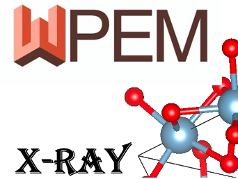

# PyXplore Desktop

<p align="center">
  
</p>

<p align="center">
  <strong>Desktop Application for X-ray Diffraction Analysis and AI-driven Structure Refinement</strong>
</p>

<p align="center">
  <a href="https://github.com/ZhouXuan-Yu/PyXplore_pyqt">GitHub Repository</a> ·
  <a href="https://pyxplore.netlify.app/">Algorithm Documentation</a> ·
  <a href="https://arxiv.org/abs/2602.16372">Paper (arXiv)</a>
</p>

---

## Overview

**PyXplore Desktop** is a PyQt5-based desktop application that provides a graphical interface for the [PyXplore (PyWPEM)](https://github.com/Bin-Cao/PyWPEM) library. It integrates comprehensive X-ray diffraction (XRD) analysis capabilities with AI-driven structure refinement, enabling researchers to perform complex crystallographic analyses through an intuitive desktop environment.

---

## Features

### Core Analysis Modules

| Module | Description |
|--------|-------------|
| **Background Deduction** | Remove background from XRD data using FFT filtering and Savitzky-Golay smoothing |
| **CIF Preprocess** | Parse CIF files, calculate crystallographic parameters, and visualize unit cells |
| **XRD Simulation** | Simulate XRD patterns from crystal structures with configurable parameters |
| **XRD Refinement** | Full pattern decomposition and lattice constant refinement using the WPEM method |
| **Amorphous Analysis** | Gaussian mixture model peak fitting and Radial Distribution Function (RDF) calculation |
| **XPS Analysis** | X-ray photoelectron spectroscopy decomposition and peak fitting |
| **EXAFS Analysis** | Extended X-ray absorption fine structure analysis with Fourier/wavelet transforms |
| **Batch Processing** | Process multiple files with consistent parameters |

### Key Capabilities

- **Multi-format Support**: Import CSV, TXT, DAT, XRDML and other common data formats
- **Interactive Visualization**: Real-time plotting with zoom, pan, and export capabilities
- **AI-assisted Refinement**: WPEM-based optimization for accurate quantitative phase analysis
- **Extinction & Wyckoff Handling**: Symmetry-aware preprocessing for structural filtering
- **Multi-modal Analysis**: Integrated support for XRD, XPS, and XAS techniques

---

## Installation

### Prerequisites

- Python 3.10.x（推荐 3.10.18，用于打包）
- PyInstaller
- Windows 10/11（打包与分发）
- Git

> **注意**：避免使用 Python 3.13/3.14 打包，PyInstaller 与部分轮子可能尚未完全适配。

### 快速安装（开发模式）

1. **克隆仓库**：
   ```bash
   git clone https://github.com/ZhouXuan-Yu/PyXplore_pyqt.git
   cd PyXplore_pyqt
   ```

2. **安装依赖**：
   ```bash
   pip install -r requirements.txt
   pip install -r desktop_app/requirements.txt
   ```

3. **运行应用**：
   ```bash
   cd desktop_app
   python main.py
   ```
   或在 Windows 上双击 `run.bat`。

---

## Packaging (Windows)

本节介绍如何将 PyXplore Desktop 打包为独立可执行文件（无需目标机器安装 Python 或任何依赖库）。

### 准备工作

#### 1. 安装 Python 3.10.18

推荐从 [Python 官网](https://www.python.org/downloads/release/python-31018/) 下载 `Windows x86_64 executable installer`，安装时勾选 **Add Python to PATH**。

或者，如果你已安装 [StabilityMatrix](https://github.com/LyonStagner/StabilityMatrix)，其内置了 Python 3.10.18，路径通常为：
```
D:\StabilityMatrix-win-x64\Data\Assets\Python\cpython-3.10.18-windows-x86_64-none\python.exe
```

#### 2. 确认打包用 Python 版本

打包前，打开命令提示符确认：

```bash
python --version
```

- 如果显示 `Python 3.10.x` → 可直接运行 `build.bat`
- 如果显示 `Python 3.14.x` 或其他版本 → 需按以下方式指向 3.10.18：

```batch
:: 在运行 build.bat 前设置（临时生效，仅当前命令行窗口有效）
set PYTHON310_EXE=C:\Python310\python.exe
build.bat
```

#### 3. 编辑 `build.bat` 中的路径（可选）

如果 Python 3.10.18 安装在其他位置，编辑 `build.bat` 第 9 行：

```batch
set "PYTHON310_EXE=D:\你的实际路径\cpython-3.10.18-windows-x86_64-none\python.exe"
```

### 开始打包

1. 打开 **命令提示符（cmd）**，切换到项目根目录：
   ```batch
   cd /d D:\Aprogress\PyWPEM
   ```

2. 运行打包脚本：
   ```batch
   build.bat
   ```

   脚本会自动完成：
   - 验证 Python 版本（必须是 3.10.x）
   - 检查 / 安装 PyInstaller
   - 检查 / 安装核心依赖（PyQt5、NumPy、SciPy、Matplotlib 等）
   - 清理旧的 `build/` 和 `dist/` 目录
   - 执行 PyInstaller 打包

3. 确认打包成功：

   PyInstaller 输出中应显示：
   ```
   Python: 3.10.x        ← 不是 3.14
   Platform: Windows-...
   ```

   打包完成后在项目根目录生成：
   ```
   dist\
   └── PyXplore_Desktop\           ← 整个文件夹即为可分发内容
       ├── PyXplore_Desktop.exe   ← 双击此文件运行
       ├── _internal\             ← 依赖库和源码
       ├── python3xx.dll
       └── ...
   ```

### 常见错误排查

| 错误信息 | 原因 | 解决方案 |
|----------|------|----------|
| `Failed to load Python DLL` | 运行了 `build/` 下的 exe | 运行 `dist/PyXplore_Desktop/` 下的 exe |
| `LoadLibrary: vcruntime140.dll` | 缺少 VC++ 运行库 | 安装 [VC++ Redistributable x64](https://aka.ms/vs/17/release/vc_redist.x64.exe) |
| `Python: 3.14.0` 出现在日志中 | 默认 python 指向 3.14 | 设置 `PYTHON310_EXE` 环境变量指向 3.10.18 |
| 打包中途崩溃（exit code 3221225477） | CPU 不支持 AVX/AVX2 | spec 已禁用 TensorFlow 分析子进程，通常不影响 |

详细说明见 [docs/PACKAGING_WINDOWS.md](./docs/PACKAGING_WINDOWS.md)。

---

## Distribution — 分发与使用

打包完成后，`dist\PyXplore_Desktop\` 文件夹即为完整可分发包。

### 分发流程

1. 将整个 `dist\PyXplore_Desktop\` 文件夹压缩为 zip（或 tar.gz）：

   ```
   PyXplore_Desktop_v1.0.zip   ← 包含所有依赖，可直接分发
   ```

2. 将 zip 发给对方，解压到任意目录。

3. 对方双击 `PyXplore_Desktop.exe` 即可运行。

### 目标机器要求

| 要求 | 说明 |
|------|------|
| 操作系统 | Windows 10/11 x64 |
| VC++ 运行库 | 通常自带；如报错 `vcruntime140.dll`，安装 [VC++ Redistributable](https://aka.ms/vs/17/release/vc_redist.x64.exe) |
| Python | **不需要**（已打包在内） |
| 其他依赖 | **不需要**（全部在 `_internal/` 中） |

### 重要提示

- **不要只拷贝 exe 文件**：必须保留整个 `PyXplore_Desktop/` 文件夹（包含 `_internal/` 等依赖目录）。
- **不要运行 `build/` 下的 exe**：那是 PyInstaller 中间产物，会报 DLL 错误。
- **TensorFlow / 晶格弛豫不可用**：因 CPU 兼容性问题，spec 中已排除 TensorFlow。其他所有功能（XRD 精修、CIF 处理、背景扣除等）完全正常。

---

## Running the Application

### Main Window Layout

```
┌─────────────────────────────────────────────────────────────────┐
│  PyXplore Desktop                                    [─][□][×]  │
├─────────────────────────────────────────────────────────────────┤
│  File  Edit  View  Tools  Help                                  │
├────────────┬────────────────────────────────────────────────────┤
│            │                                                     │
│  📁 Background     │                                              │
│  📁 CIF Preprocess│          Content Area                        │
│  📁 XRD Simulation│    (Dynamic based on selected module)       │
│  📁 XRD Refinement │                                              │
│  📁 Amorphous      │                                              │
│  📁 XPS            │                                              │
│  📁 EXAFS          │                                              │
│  📁 Batch          │                                              │
│            │                                                     │
├────────────┴────────────────────────────────────────────────────┤
│  Status: Ready                                                  │
└─────────────────────────────────────────────────────────────────┘
```

### Module Descriptions

#### Background Deduction
- Import XRD, Raman, or XPS data files
- FFT-based low-frequency filtering
- Savitzky-Golay smoothing for background extraction
- Configurable parameters: filter percentage, split number, polynomial order

#### CIF Preprocess
- Parse CIF crystallographic files
- Calculate lattice constants (a, b, c, α, β, γ)
- Generate atomic coordinate tables
- Optional structure relaxation using M3GNet（需在支持 AVX2 的环境下重新打包）

#### XRD Simulation
- Simulate diffraction patterns from crystal structures
- Configurable wavelength (CuKα, CoKα, MoKα, custom)
- Super cell generation and solid solution modeling
- Peak broadening based on grain size
- Zero shift correction

#### XRD Refinement
- WPEM-based full pattern decomposition
- Multi-phase quantitative analysis
- Lattice constant optimization
- R-factor reporting (Rp, Rwp)

#### Amorphous Analysis
- **Peak Fitting**: Gaussian mixture model for amorphous peak deconvolution
- **RDF Calculation**: Radial distribution function computation from diffraction data

#### XPS Analysis
- Peak decomposition for photoelectron spectra
- Support for multiple atomic species and satellite peaks
- Pseudo-Voigt function fitting

#### EXAFS Analysis
- k-space processing and weighting
- Fourier transform to R-space
- Wavelet transform option for enhanced resolution

#### Batch Processing
- Process multiple files in sequence
- Template-based parameter management
- Progress tracking and result export

---

## Project Structure

```
PyXplore_pyqt/
├── build.bat                    # 打包脚本（Windows）
├── PyXplore_Desktop.spec        # PyInstaller 打包配置
├── desktop_app/
│   ├── main.py                 # Application entry point
│   ├── run.py                  # Launch script
│   ├── run.bat                 # Windows launch script
│   ├── requirements.txt        # Desktop app dependencies
│   ├── app/
│   │   ├── main_window.py      # Main window (QMainWindow)
│   │   ├── base_page.py        # Base class for module pages
│   │   ├── config.py           # Configuration management
│   │   ├── utils.py            # Utility functions
│   │   └── modules/            # Functional modules
│   │       ├── background/     # Background deduction
│   │       ├── cif_preprocess/ # CIF preprocessing
│   │       ├── xrd_simulation/ # XRD simulation
│   │       ├── xrd_refinement/ # XRD refinement
│   │       ├── amorphous/      # Amorphous analysis
│   │       ├── xps/           # XPS analysis
│   │       ├── exafs/         # EXAFS analysis
│   │       └── batch/         # Batch processing
│   └── ConvertedDocuments/    # Sample data files
├── dist/                       # 打包输出目录（打包后生成）
│   └── PyXplore_Desktop/      # 可分发包，双击 exe 运行
├── src/                        # PyXplore core library
├── logos/                      # Application logos
├── docs/                       # Documentation
│   └── PACKAGING_WINDOWS.md  # Windows 打包详细说明
└── requirements.txt           # Core dependencies
```

---

## Technical Stack

| Component | Technology |
|-----------|------------|
| Frontend Framework | PyQt5 5.15+ |
| Visualization | Matplotlib + FigureCanvasQTAgg |
| Data Processing | NumPy, Pandas, SciPy |
| Core Algorithms | PyXplore (WPEM) |
| AI/ML | TensorFlow / M3GNet（可选，打包版默认不包含） |

---

## Scientific Reference

If you use **PyXplore Desktop** in your research, please cite:

```bibtex
@article{cao2026wpem,
  title={AI-Driven Structure Refinement of X-ray Diffraction},
  author={Bin Cao, Qian Zhang, Zhenjie Feng, Taolue Zhang, Jiaqiang Huang, Lu-Tao Weng, Tong-Yi Zhang},
  journal={arXiv preprint},
  year={2026},
  url={https://arxiv.org/abs/2602.16372v1}
}
```

---

## License

This project is released under the MIT License.

---

## Contributing

Contributions are welcome! Please feel free to submit issues or pull requests.

---

## Contact

For questions or support, please contact:
- **Email**: bcao686@connect.hkust-gz.edu.cn
- **Affiliation**: Hong Kong University of Science and Technology (Guangzhou)
